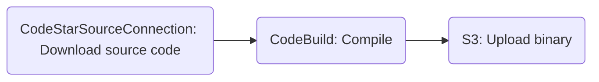

# sample-codepipeline-compile-publish

This sample creates a CodePipeline pipeline that builds the [fzf](https://github.com/junegunn/fzf/) project, runs tests and publishes the compiled binary to S3.

Start LocalStack using any supported method.

You must set `CODEPIPELINE_GH_TOKEN` environment config option to the [PAT token](https://docs.github.com/en/authentication/keeping-your-account-and-data-secure/managing-your-personal-access-tokens#creating-a-fine-grained-personal-access-token). GitHub requires this to [download](https://docs.github.com/en/rest/repos/contents?apiVersion=2022-11-28#download-a-repository-archive-zip) even public repositories.

Run the following script which will create all prerequisite resource and the pipeline. It will also download the compiled binary from the S3 bucket and execute it.

```
bash run.sh
```

The pipeline is structured as follows:


