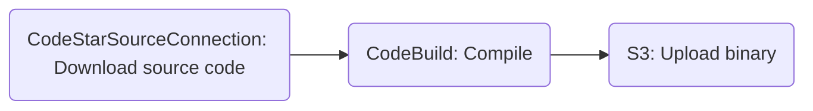

# sample-codepipeline-compile-publish

This sample creates a CodePipeline pipeline that builds the [fzf](https://github.com/junegunn/fzf/) project and publishes the compiled binary to S3.

You must set `CODEPIPELINE_GH_TOKEN` environment config option to the [PAT token](https://docs.github.com/en/authentication/keeping-your-account-and-data-secure/managing-your-personal-access-tokens#creating-a-fine-grained-personal-access-token). GitHub requires this to [download](https://docs.github.com/en/rest/repos/contents?apiVersion=2022-11-28#download-a-repository-archive-zip) even public repositories.

Start LocalStack using [any supported method](https://docs.localstack.cloud/getting-started/installation/#starting-localstack), or:

```
docker run \
-it \
-v /var/run/docker.sock:/var/run/docker.sock \
-v "./volume:/var/lib/localstack" \
-e DEBUG=1 \
-p 4566:4566 \
-p 4510-4559:4510-4559 \
-e DOCKER_HOST=unix:///var/run/docker.sock \
-e LOCALSTACK_AUTH_TOKEN=${LOCALSTACK_AUTH_TOKEN} \
-e CODEPIPELINE_GH_TOKEN=${CODEPIPELINE_GH_TOKEN} \
localstack/localstack-pro:latest
```

Run the following script which will create all prerequisite resource and the pipeline. It will also download the compiled binary from the S3 bucket and execute it.

```
bash run.sh
```

The pipeline is structured as follows:


